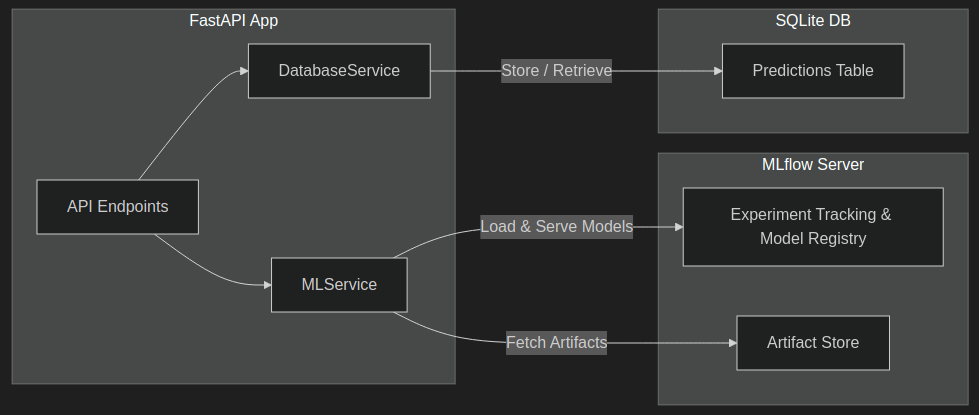

# ML Engineer App

A basic application running a POC ML model aroung a ML Engineer context.

## Services

The application is composed of the following main services:

- **MLflow**: Handles experiment tracking, model management, and artifact storage. Runs on port `5000`.
- **FastAPI App**: Serves the API endpoints for model predictions, health checks, and more. Runs on port `8000`.

These services interact via shared volumes for model runs and artifacts, and the FastAPI app depends on MLflow being healthy before starting.

## Features

- **Model Management**: Load, track, and serve ML models using MLflow.
- **Prediction API**: Expose endpoints for making predictions.
- **Health Checks**: Monitor service health via dedicated endpoints.
- **Database Integration**: Store and retrieve metadata using a database service.

## Getting Started

To set up and run the project, simply execute the setup script from the project root:

```bash
./config/setup.sh
```

This will configure the environment and start all necessary services.

## Project Structure

- `docker-compose.yml`: Defines service orchestration.
- `src/py/`: Contains all Python source code, including API routes and service logic.
- `mlruns`, `mlartifacts`, `mlflow_data`: Directories for MLflow tracking and artifacts.

## API Documentation

Once running, access the API documentation at [http://localhost:8000/docs](http://localhost:8000/docs).

---

