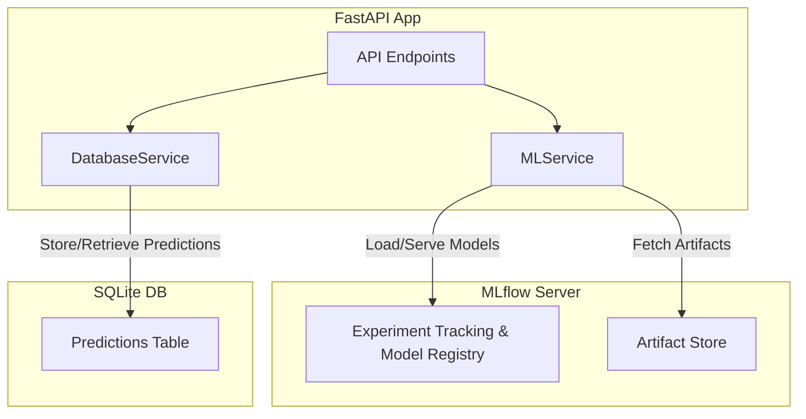

```mermaid
graph TD
    subgraph FastAPI App
        A[API Endpoints]
        B[MLService]
        C[DatabaseService]
    end

    subgraph MLflow Server
        D[Experiment Tracking & Model Registry]
        E[Artifact Store]
    end

    subgraph SQLite DB
        F[Predictions Table]
    end

    A --> B
    A --> C
    B -- "Load/Serve Models" --> D
    B -- "Fetch Artifacts" --> E
    C -- "Store/Retrieve Predictions" --> F
```